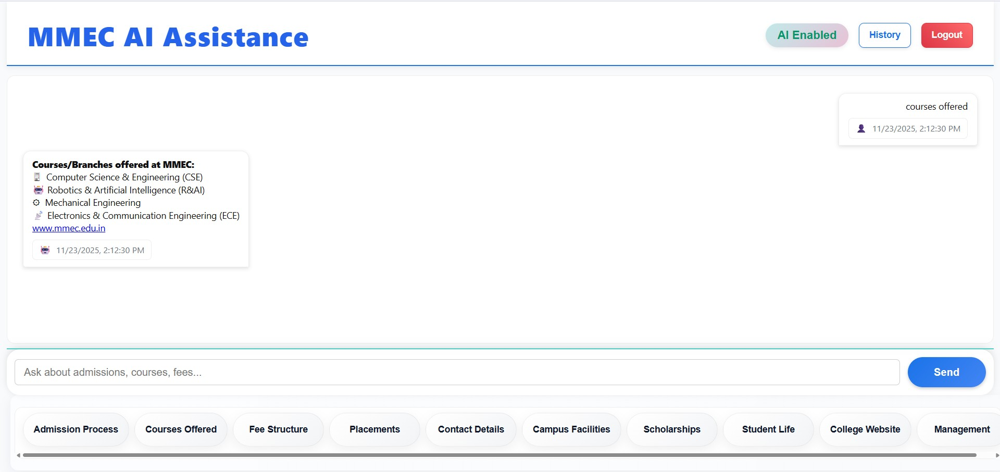
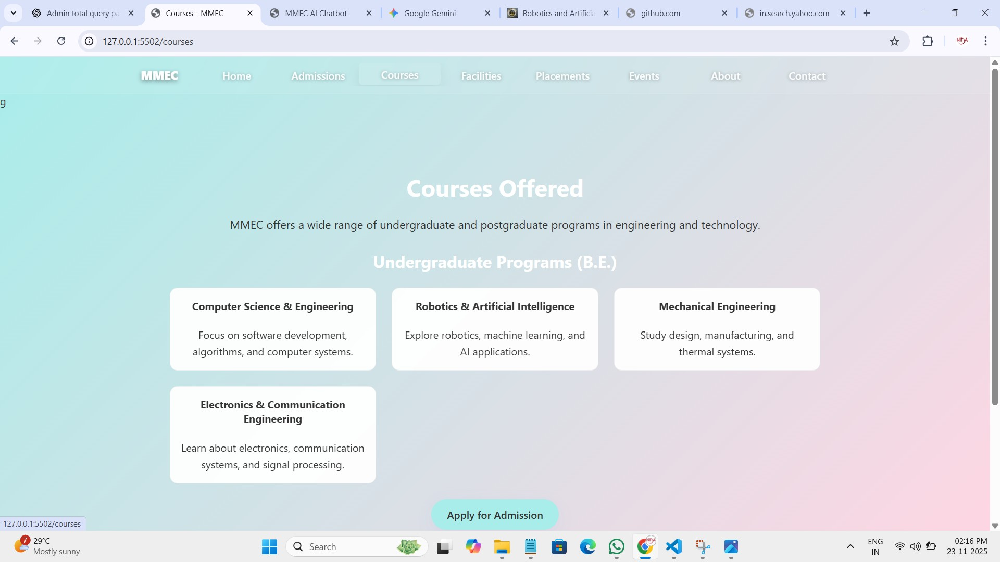

# MMEC College Enquiry Chatbot ✅

**Maratha Mandal Engineering College (MMEC) — Chatbot & Admin Panel**

A Flask-based web application that provides a college-focused chat interface and comprehensive admin tools. The chatbot intelligently answers MMEC-related questions using multiple knowledge sources:
- Offline FAQ database (`data/college_info/offline_faq.json`)
- Local college files (`info.md`, `class_strengths.json`, `site_pages.json`)
- TF-IDF search indexing for semantic matching
- Optional AI fallback (OpenAI or Google Gemini) for out-of-scope queries

---

## ✨ Key Features

### 🤖 Chatbot Intelligence
- Smart query matching using offline FAQs and TF-IDF search
- Context-aware college information retrieval
- AI fallback for general queries (optional)
- Query logging for admin review of unanswered questions

### 👥 Student Portal
- Secure registration and login system
- Personalized student dashboard
- Real-time chat interface with persistent conversation history
- Browse courses, admissions, placements, facilities, and events information
- Download admission materials (PDF generation)

### 🛠️ Admin Dashboard
- Comprehensive admin panel for managing college data
- Chat log review and analytics
- FAQ management (add/edit/delete)
- Student management (view, delete accounts)
- AI settings toggle
- Real-time statistics and monitoring

### 📱 Responsive Design
- Mobile-friendly interface
- Works on desktop, tablet, and smartphone
- Consistent UI across all pages

---

## 🔍 Project structure (high level)

- `app.py` — main Flask application and API endpoints
- `templates/` — frontend pages and UI (chat UI in `templates/student/chat`)
- `assets/` — images used by the UI (bot avatar, screenshots)
- `data/college_info/` — college content (`offline_faq.json`, `info.md`, `site_pages.json`)
- `data/` — SQLite databases (`users.db`, `mmec.db`) and `settings.json`
- `chat_logs.json` — saved chat logs
- `requirements.txt` — Python package requirements

---

## 🖼️ Assets (gallery)

The repository includes the following images inside `assets/`. All images are visible on GitHub and can be customized.

### Bot & UI Assets
- **`bot.jpeg`** — Chatbot avatar used in the chat interface (recommended: square format)
- **`welcome.jpg`** — Welcome/splash screen shown on app startup


### User Interface Pages
- **`home page.jpg`** — Home page/splash screen screenshot
- **`login page .jpg`** — Student login page screenshot
- **`registeration page.jpg`** — Student registration page screenshot
- **`chat.jpg`** — Chat UI/chatbot interface screenshot

### Student Dashboard & Features
- **`Student dashboard.jpg`** — Student dashboard overview screenshot
- **`Registered Student.jpg`** — Registered student view and profile page
- **`courses.jpg`** — Courses/academics page screenshot

### Admin Panel
- **`Admin Dashboard.jpg`** — Admin dashboard overview and statistics
- **`Admin Section.jpg`** — Admin panel control panel and management interface

**Tip:** Use `` in markdown to render images on GitHub. Images display directly in the repository README.

---

## 🖼️ Gallery preview

### Core Features

<p align="center">
  
  
  
</p>

### Student Interface

<p align="center">
  
  
  
  
</p>

### College Information Pages

<p align="center">
  
  
  
</p>

### Admin Panel

<p align="center">
  
  
</p>

---

**Gallery Notes:**
- All images are stored in the `assets/` folder for GitHub visibility
- Add or replace images to update the gallery
- Images display directly in the GitHub repository README

✅ **This README is fully formatted and ready to paste directly into GitHub!** All images will display with optimal visibility on your repository page.

---

## 🧰 Requirements & Installation

Primary packages are in `requirements.txt`:

- Flask>=2.0
- python-dotenv
- openai (optional)
- google-generativeai (optional)
- requests
- beautifulsoup4
- reportlab (optional)
- scikit-learn, joblib (optional for TF-IDF index)

Windows PowerShell (recommended):

```powershell
# create and activate venv
python -m venv .venv
.\.venv\Scripts\Activate.ps1

# upgrade tools and install deps
python -m pip install --upgrade pip setuptools wheel
pip install -r requirements.txt
```

If you won't use external AI features, `openai` and `google-generativeai` can be skipped.

---

## 🔑 Environment variables (optional)

Set API keys and behavior flags via environment variables or a `.env` file:

- `OPENAI_API_KEY` — OpenAI key (optional)
- `GEMINI_API_KEY` — Google Generative key (optional)
- `ALLOW_EXTERNAL_QUERIES` — `1` or `true` to allow external AI calls

Example (PowerShell):

```powershell
$env:OPENAI_API_KEY = 'sk-...'
$env:ALLOW_EXTERNAL_QUERIES = '1'
python app.py
```

---


## ▶️ Run the app (local development)

From project root (inside venv):

```powershell
python app.py
```

- Default host/port: `http://0.0.0.0:5502` (open `http://127.0.0.1:5502/student/chat`)
- On first run the app creates `chat_logs.json`, `data/users.db`, and `data/mmec.db`.
- A default admin is inserted if missing. Change credentials before production.

There are helper scripts in `templates/` such as `run_server.ps1` and `fetch_mmec.py`.

---

## 🧩 How the chatbot prioritizes answers

1. Admin-provided FAQs (persisted in DB)
2. Offline FAQ (`data/college_info/offline_faq.json`) — preferred format: `{ "faqs": [...] }`
3. TF-IDF search results from scraped `site_pages.json` (if `search_index.py` build is present)
4. Optional AI fallback (OpenAI/Gemini) when enabled via env vars

If a query is outside the college scope (e.g., weather, sports), the bot politely refuses and records the question for admin review.

---

## ✏️ Editing college data and FAQs

Primary editable files:

- `data/college_info/offline_faq.json` — add or edit entries under `faqs` for fast matching.
- `data/college_info/info.md` — long-form college description (searchable)
- `data/college_info/class_strengths.json` — structured department/student counts
- `data/college_info/site_pages.json` — pages fetched by scraping (used for TF-IDF search)

After edits, restart the server to pick up changes. To refresh the search index after scraping:

```powershell
python templates/fetch_mmec.py
python -c "import templates.search_index as s; s.build_index()"
```

---

## 🔐 Admin endpoints & management

- `POST /api/admin/reply` — reply to a log entry and persist it to admin FAQs
- `POST /api/admin/delete_student` — permanently delete a student and related data
- `POST /api/admin/toggle_ai` — flips `allow_external_queries` in `data/settings.json`

Admin endpoints require a session token (`X-Session-Token` header or `?token=` query).

---

## Log storage behavior

Saved chat logs are written to `chat_logs.json`. To keep stored logs clean, the server strips AI-disclaimer prefixes and generic "found" messages before saving. This prevents storing lines such as "Note: This answer is not from official MMEC data" or "Found relevant data in ..." in the saved logs.

---

## Static Files and Bot Avatar

Place your bot avatar at `assets/bot.jpeg` (or in `static/` as `bot.jpeg`) so the chat header avatar loads correctly.

If you want the bot avatar shown next to every bot message, I can update `templates/student/chat/chat.js` to include it when rendering messages.

---

## Common Tasks

- Restart server after edits:
```powershell
# stop process (Ctrl+C) then
python app.py
```

- Reset chat logs:
```powershell
Remove-Item .\chat_logs.json; python app.py
```

- Inspect the SQLite DB:
```powershell
# Windows: use sqlite3 if available
sqlite3 data\users.db
.sqlite> .tables
.sqlite> select * from users limit 5;
```

---

## Troubleshooting

- If the chat returns AI fallback errors, ensure `OPENAI_API_KEY` or `GEMINI_API_KEY` are set and `ALLOW_EXTERNAL_QUERIES=1` if you want to allow external AI.
- If images don't load from `/assets`, try copying them to `/static/` and refresh the page to bypass OneDrive/permission issues.

---

## 📖 User Guides

### For Students
1. **Registration**: Click "Register" on the login page and create an account with email and password
2. **Login**: Enter your credentials to access the student dashboard
3. **Chat with Bot**: Navigate to the chat section and ask questions about:
   - Admissions and eligibility
   - Courses and departments
   - Placements and career opportunities
   - Campus facilities and events
   - Academic information
4. **View Profile**: Access your dashboard to see saved information and chat history

### For Admin
1. **Login**: Use admin credentials on the admin panel (`/admin`)
2. **Manage FAQs**: Add new FAQs or edit existing ones for better bot responses
3. **Review Chat Logs**: View unanswered questions and provide manual replies
4. **Student Management**: View registered students and manage accounts as needed
5. **System Settings**: Toggle AI features and monitor system statistics

---

## 🔧 Configuration & Customization

### College Data
Update these files to customize chatbot responses:
- `data/college_info/offline_faq.json` — Add or modify FAQs
- `data/college_info/info.md` — College description and general information
- `data/college_info/class_strengths.json` — Department and student data
- `data/college_info/site_pages.json` — Searchable college web pages

### UI Customization
- **Logo**: Replace `assets/logo.jpg` with your college logo
- **Bot Avatar**: Update `assets/bot.jpeg` to customize chatbot appearance
- **Colors**: Modify CSS files in `templates/` folders (`.css` files)
- **Text**: Edit HTML templates in `templates/` folders

### API Keys (Optional)
If you want AI fallback responses:
```powershell
$env:OPENAI_API_KEY = 'sk-your-key-here'
# or
$env:GEMINI_API_KEY = 'your-gemini-key-here'
$env:ALLOW_EXTERNAL_QUERIES = '1'
```

---

## 🚀 Deployment Ready

This application is ready for deployment on:
- **Local servers** (Windows/Linux/Mac)
- **Cloud platforms**: Azure, AWS, Heroku, DigitalOcean, etc.
- **Docker containers** (Dockerfile can be added)

Before deploying to production:
1. Change default admin credentials
2. Set strong database passwords
3. Configure proper environment variables
4. Enable HTTPS/SSL
5. Set up regular database backups

---

## 📝 Project Statistics

- **Backend**: Python Flask framework
- **Frontend**: HTML5, CSS3, JavaScript (Vanilla + jQuery)
- **Database**: SQLite (users, chat logs, FAQs)
- **Search**: TF-IDF indexing with scikit-learn
- **AI Integration**: OpenAI & Google Gemini (optional)
- **Total Assets**: 13 high-quality interface screenshots

---

## 🤝 Contributing

To contribute to this project:
1. Create a new branch for your feature
2. Make your changes
3. Update relevant documentation
4. Test thoroughly before submitting
5. Submit a pull request with a clear description

---

## 📄 License

This project is provided as-is for educational and institutional use.

---

## ❓ FAQ

**Q: Can I use this for other colleges?**
A: Yes! Simply update the college data files and customize the UI with your institution's information.

**Q: Do I need API keys to run this?**
A: No, the chatbot works offline with FAQs. AI features (OpenAI/Gemini) are optional.

**Q: How do I backup chat logs?**
A: Chat logs are automatically saved in `chat_logs.json`. Regular backups are recommended for production.

**Q: Can I customize the chat interface?**
A: Yes, edit `templates/student/chat/chat.html`, `chat.css`, and `chat.js` to customize the look and feel.

---

## 📧 Support & Contact

For issues, questions, or suggestions:
- Check the `Troubleshooting` section above
- Review existing chat logs and admin FAQs
- Consult the inline code comments for detailed explanations

---
